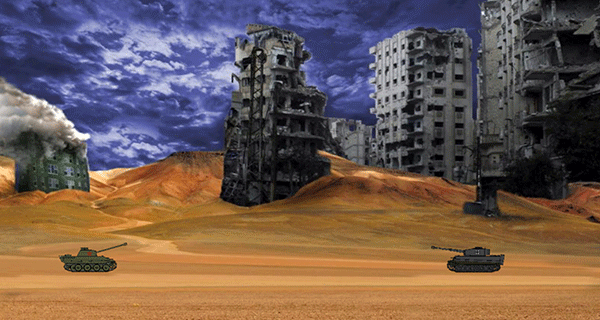

[](https://mudroljub.github.io/tenkici/)

# Tenkići igrica
> verzija 1.1.

Igraj ovde: [mudroljub.github.io/tenkici](https://mudroljub.github.io/tenkici/)

Ima i verzija za fejs: [apps.facebook.com/igrica-tenkici/](https://apps.facebook.com/igrica-tenkici/)

P.S. Ako ne učita iz prve osveži browser.

## Razvoj

Prvo instaliraj [node.js](https://nodejs.org), noviju verziju. Nakon toga kloniraj repo i instaliraj zavisnosti:
```
npm install
git submodule init
git submodule update
```

ili samo
```
npm run fullinstall
```

Da pokreneš igru u razvojnom modu ukucaj:
```
npm start
```
Browser će se automatski osvežavati svaki put kada sačuvaš izmenu.

## Produkcija

U produkciji mora webpack publicPath: './dist/'

Pre dizanja na gh-pages potrebno obrisati submodule!

Za fb verziju ubaciti fb skripte u index.html

## Istorija izmena

Verzija 1.1.
* ubačen plamen
* igraj ponovo na enter
* animacija se nastavlja nakon kraja nivoa
* malo sredjena igrivost

## TODO
* fb login
* ubaciti zvuk
* refaktorisati (Tenk klasa, Tenk1 i Tenk2 naslednici, Cev.render, prebaciti Plamen na Tenk)
* bug: neprijatelj nekad opali pre pocetka scene
